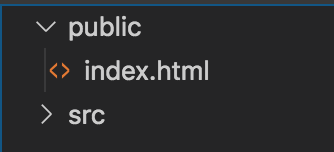
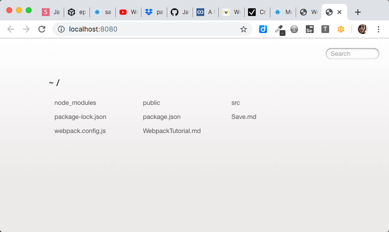

# Webpack Tutorial

Press `command+shift+v` on Mac or `ctrl+shift+v` on Windows to preview this in Visual Studio Code.

## Setting up the Project

Create a new folder for this project and open it in Visual Studio Code. Then create more folder and files within this project like this:

```
> public
  index.html
> src
```



Inside your _index.html_ file, paste this and save:

```html
<!DOCTYPE html>
<html lang="en">
  <head>
    <meta charset="UTF-8" />
    <meta name="viewport" content="width=device-width, initial-scale=1.0" />
    <title>Webpack Tutorial</title>
  </head>

  <body>
    <h1>Hi There,</h1>
    <p>If you see an alert, this works!</p>
  </body>
</html>
```

You will then need to initialize your project's dependencies and start scripts with npm. In your terminal, enter the following:

```bash
npm init -y
```

This should create a file called _package.json_. Open that file and make some modificiations. This is what I did:

```json
{
  "name": "webpack-tutorial",
  "version": "1.0.0",
  "engine": {
    "node": "10.12.0"
  },
  "scripts": {},
  "author": "Your Name",
  "private": true
}
```

Where you see node above, it should be your current node version. To figure this out, type `node -v`

## Building Your First JavaScript File

You will need to install the developer dependencies _webpack_ and _webpack-cli_. Type this in your terminal:

```bash
npm install webpack webpack-cli --save-dev
```

Your project should now have a _node_modules_ folder. This is where _webpack_ and _webpack-cli_ were installed. It is important **not to commit our node_modules folder to git**. Create a file called `.gitignore` and put this in the .gitignore file: (Alternatively, you can just copy and paste a .gitignore file from https://www.gitignore.io/. Search for _node_.)

```
node_modules/
```

Open up your _package.json_ file again and notice that this below was automatically added to the file. (Your versions may be different):

```json
  "devDependencies": {
    "webpack": "^4.41.2",
    "webpack-cli": "^3.3.10"
  }
```

In order to run Webpack, we are going to create an npm script in the _package.json_ file like this:

```json
  "scripts": {
    "build": "webpack"
  },
```

Try to typing `npm run build` in your terminal. You should get this error:


This is because we need an entry point - a source file that is the starting point - in order for this to work. Create a file called `index.js` inside of the `src` folder.

```
> public
  index.html
> src
  index.js
```

Paste this inside of the `index.js` file and save:

```javascript
alert("It works!");
```

Now run `npm run build` in your terminal again. Now you should see a success message like this:


Notice that the script you just ran created a new file _main.js_ inside a new folder _dist_.

```
> dist
  main.js
> public
  index.html
> src
  index.js
```

Open the _main.js_ file. You should see a lot off additional code with no whitespace. This is a production build. (We will go over this later).

Now, lets add the `<script>` tag to our _index.html_ below so that our website will include our _main.js_ file.

```html
<head>
  <meta charset="UTF-8" />
  <meta name="viewport" content="width=device-width, initial-scale=1.0" />
  <title>Webpack Tutorial</title>
  <!-- Add this script tag -->
  <script src="../dist/main.js" defer></script>
</head>
```

Open your _index.html_ file in your browser of choice and open the _Developer Tools_. An alert should popup. It should look like this in Chrome:


Right now, we must organize our file structure in a certain way. We must have an _index.js_ for the input file and _main.js_ for output file like this:

```
> dist
  main.js  (output)
> src
  index.js  (input)
```

Let's say we want to our output file (_main.js_) to go into a folder called _assets_ inside the _public_ folder like this:

```
> public
  > assets
    main.js  (output)
  index.html
> src
  index.js  (input)
```

To do this, we need to change Webpack's configuration. Create a file called _webpack.config.js_. Inside of _webpack.config.js_, paste this and save:

```javascript
const path = require("path");

module.exports = {
  entry: "./src/index.js", // Your input file
  output: {
    filename: "main.js", // Your output filename
    path: path.resolve(__dirname, "./public/assets"), // Output file path
    publicPath: "/assets/" // Folder where all Webpack generated code will go
  }
};
```

Delete the _dist_ folder and run `npm run build`. You should now see an _assets_ folder inside your _public_ folder, and _main.js_ should be inside the _assets_ folder. Let's update the `<script>` tag inside _index.html_ file to point to this.

```html
<head>
  <meta charset="UTF-8" />
  <meta name="viewport" content="width=device-width, initial-scale=1.0" />
  <title>Webpack Tutorial</title>
  <!-- Update the src inside this script tag -->
  <script src="assets/main.js" defer></script>
</head>
```

When open or you refresh the _index.html_ file in your browser, it should still alert "This works!".

## Getting the Browser to Automatically Refresh

We will need to install a package called _webpack-dev-server_. To install, run this in your terminal:

```bash
npm install webpack-dev-server --save-dev
```

Now update the _package.json_ file to use the webpack-dev-server so that it will automatically refresh the browser when you run `npm run start`.

```json
  "scripts": {
    "build": "webpack",
    "start": "webpack-dev-server"
  },
```

Run `npm run start` and `command` or `ctrl` click on where it says `http://localhost:8080/`.


When you click on this link, however, it won't open your _index.html_ file. Instead, it shows the first level folder and files of this project.



To open the _index.html_ file, we will need to update your Webpack config file. In your terminal, press `ctrl+c` to stop. Now open _webpack.config.js_ and add this:

```javascript
  // ...
  output: {
    // ...
  }, // Don't forget the comma here
  devServer: {
    port: 7000,
    publicPath: "/assets/", // Folder where all Webpack generated code will go
    contentBase: path.resolve(__dirname, "./public"), // Folder that has your index.html file
    watchContentBase: true // Makes it so the browser will refresh when you make changes to the index.html file too
  }
```

Now run `npm run start` again. You should see your _index.html_ file and the JavaScript alert. Change the code inside of _src/index.js_ and see how the browser automatically refreshes. Change the code inside of your _public/index.html_ file. The browser should refresh for these changes too.

## Making Your Code Work in Old Browsers with Babel

You can refer to [Babel's installation guide](https://babeljs.io/setup#installation) and select _Webpack_.

Install Babel and Babel's plugin for Webpack.

```bash
npm install babel-loader @babel/core --save-dev
```

Update your _webpack.config.js_ file so that Webpack will use Babel.

```javascript
  // after output
  module: {
    rules: [
      {
        test: /\.js$/i,
        exclude: /node_modules/,
        loader: "babel-loader"
      }
    ]
  },
```

For supporting older browsers (especially Internet Explorer), we are going to install the package _@babel/preset-env_ too.

```bash
npm install @babel/preset-env --save-dev
```

Create a file called _.babelrc_. We are configure Babel to use the _@babel/preset-env_ package.

```json
{
  "presets": ["@babel/preset-env"],
  "retainLines": true,
  "sourceMaps": true
}
```

Now let's just update our JavaScript code so that it uses ES6. Change _input.js_ to this:

```javascript
const greet = () => {
  alert("It works!");
};

greet();
```

Now run `npm run build`. If you are on Windows, open _index.html_ in Internet Explorer. You should still see the alert popup.

## An Introduction to ES6 Modules

TODO

## Loading and Building SASS with Webpack

[SASS](https://sass-lang.com/) is a programming language for creating CSS. It let's you use features like variables, if statements, loops, color functions and nesting code.

Create a file _style.scss_ inside of _src_. Paste and save the following:

```scss
$brand-color: #4aa65e;

html,
body {
  height: 100%;
}

body {
  font-family: sans-serif;
  background: radial-gradient(
    circle,
    lighten($brand-color, 20%) 0%,
    $brand-color 100%
  );
  color: darken($brand-color, 30%);

  display: flex;
  flex-direction: column;
  justify-content: center;
  text-align: center;

  > * {
    margin: 0;
  }
}
```

Inside of _src/input.js_, you are going to import the SASS file like this:

```javascript
import "./style.scss";

// Internet Explorer does not support constants or arrow functions
const greet = () => {
  alert("It works!");
};

greet();
```

Install the library _node-sass_ and all of the loaders needed to get SASS to work with Webpack.

```bash
npm install node-sass sass-loader style-loader css-loader webpack --save-dev
```

Now add this to the rules section of your _.webpack.config.js_ so that Webpack will load and build CSS too.

```javascript
  module: {
    rules: [
      // ...
      {
        test: /\.s[ac]ss$/i,
        use: ["style-loader", "css-loader", "sass-loader"]
      }
    ]
  },
```

## Creating a Production Build

TODO

TODO source maps

# Resources

- [A Beginner’s Guide to Webpack 4](https://levelup.gitconnected.com/a-beginners-guide-to-webpack-4-a8cade06f092)
- [Webpack 4 Tutorials](https://www.youtube.com/watch?v=JsX_iCZPyOM&list=PLmTsWjOvTMNG6I3auZMjIV6ZghbvgCvm4)
- [Create App](https://createapp.dev/)
